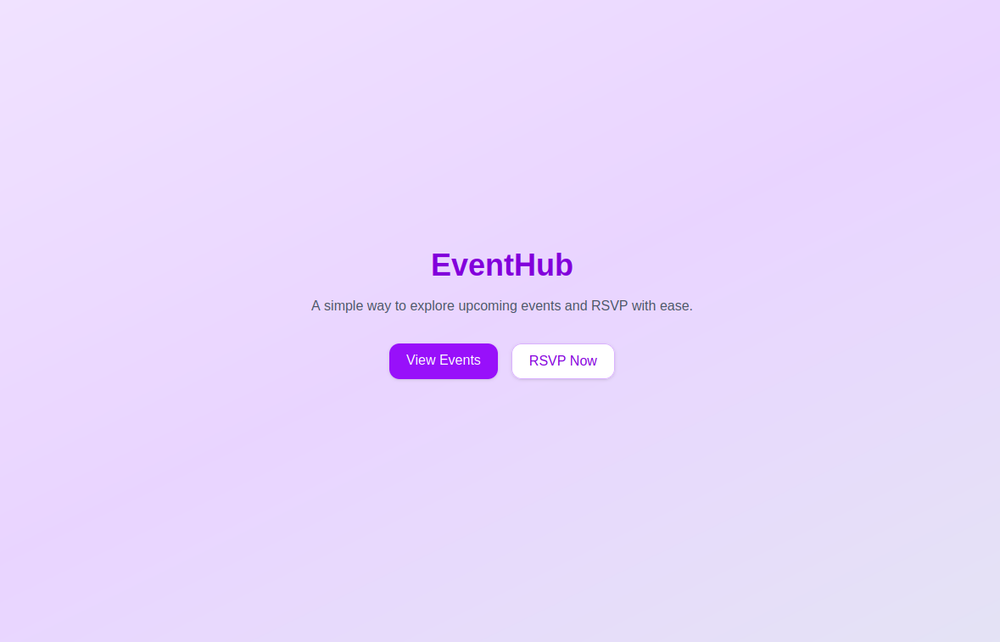
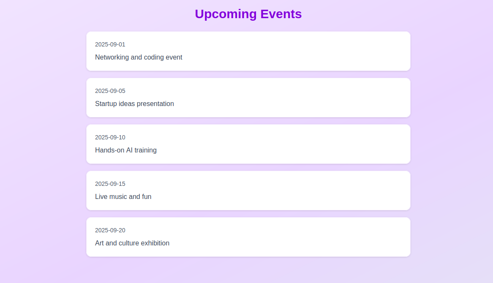
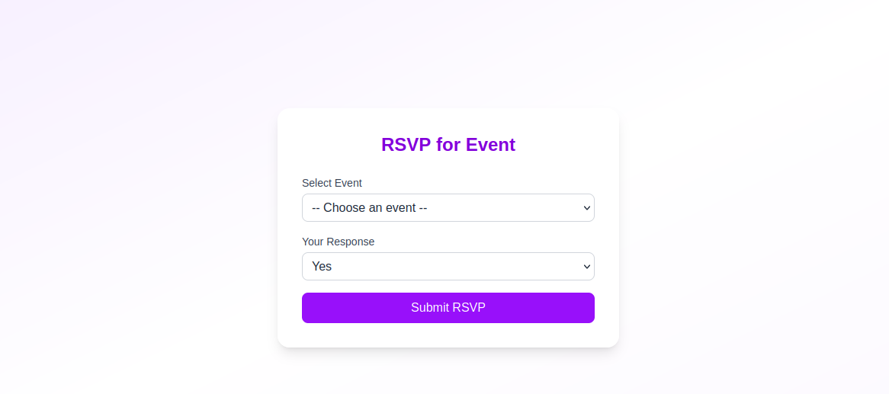

# 🎉 Event RSVP App  

A simple **Next.js + Supabase** app where users can RSVP to events.  
Deployed on **Vercel** 

---

## Features  
- View upcoming events  
- Submit RSVP (Yes / No / Maybe)  
- Data stored securely in Supabase  
- Clean UI with Tailwind CSS  

---

## Setup  

### 1️⃣ Clone Repo  
```bash
git clone https://github.com/your-username/event-rsvp-app.git
cd event-rsvp-app
```

### 2️⃣ Install Dependencies  
```bash
npm install
```

### 3️⃣ Configure Supabase  
1. Create a free [Supabase](https://supabase.com) project.  
2. Create the following tables:

#### `users` table  
| Column     | Type        | Notes                           |  
|------------|-------------|---------------------------------|  
| id         | uuid        | Primary Key                     |  
| name       | text        | User’s full name                |  
| email      | text        | Unique identifier (login/contact) |  
| created_at | timestamptz | Default `now()`                 |  

#### `events` table  
| Column     | Type       | Notes           |  
|------------|-----------|-----------------|  
| id         | uuid      | Primary Key     |  
| name       | text      | Event name      |  
| created_at | timestamptz | Default `now()` |  

#### `rsvp` table  
| Column     | Type       | Notes                      |  
|------------|-----------|----------------------------|  
| id         | uuid      | Primary Key                |  
| user_id    | uuid      | FK → users table           |  
| event_id   | uuid      | FK → events table          |  
| status     | text      | ('yes', 'no', 'maybe')     |  
| created_at | timestamptz | Default `now()`           |  

3. Add your Supabase credentials in `.env.local`:  
```env
NEXT_PUBLIC_SUPABASE_URL=your_supabase_url
NEXT_PUBLIC_SUPABASE_ANON_KEY=your_supabase_anon_key
```

---

### 4️⃣ Run Locally  
```bash
npm run dev
```
Your app will be live at 👉 [http://localhost:3000](http://localhost:3000)  

---

## Deployment  
1. Push your project to GitHub.  
2. Go to [Vercel](https://vercel.com) → **New Project → Import Repo**.  
3. Add environment variables from `.env.local`.  
4. Deploy ✅

You can check the website - [here](https://event-rsvp-app-eight.vercel.app/)

---

# Database Documentation

`SQL deliverables` folder contains all database-related deliverables for the Event RSVP App.

## Files
- **Documentation.pdf** → Documentation of schema, design choices, and setup guide.  
- **ER_diagram.png** → Visual ER diagram for quick reference.  
- **events_table.png** → Screenshot of `events` table.  
- **rsvp_table.png** → Screenshot of `rsvp` table.  
- **users_table.png** → Screenshot of `users` table.  
- **table_creation_schema.sql** → SQL dump to create all tables (`events`, `rsvp`, `users`).  
- **users_creation_schema.sql** → SQL statements specifically for creating `users` table.  
- **verifying_schema.sql** → Optional SQL queries for verifying table structure and data.  

## Usage
1. Run `table_creation_schema.sql` in your Supabase SQL editor to create the tables.  
2. Run `users_creation_schema.sql` if you only want to create `users` table.  
3. Run `verifying_schema.sql` to verify the table structure and sample data.  
4. Refer to **Documentation.pdf** for screenshots, explanations, and design rationale.  

---

## Screenshots  
### Homepage


### Events Page


### RSVP Form
 

---

## Author  
Built by **Deep** 
